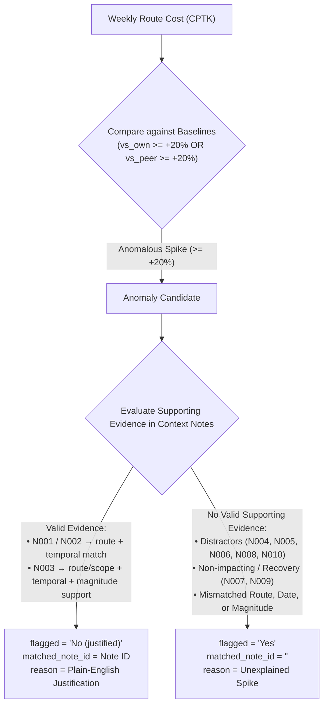
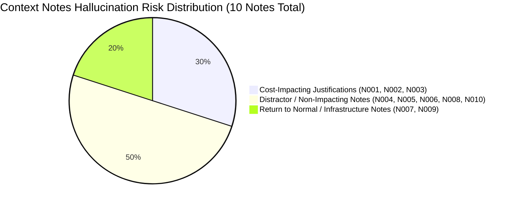

# Data & Requirements Analysis: FreightTiger Shipping Cost Assistant

> **Case Study**: FreightTiger Software Engineering Intern (AI) — 24-Hour Case Study  
> **Target Output Artifact**: `DATA_ANALYSIS.md`  
> **Status**: Analytical Phase Completed (No code execution/LLM implementation performed in source files per strict directive)

---

## 1. Shipment Dataset Analysis (`data/shipment_records.csv`)

### 1.1 Dataset Metadata & Schema

| Column Name | Data Type | Analytical Type | Example Value | Description |
| :--- | :--- | :--- | :--- | :--- |
| `shipment_id` | String | Unique Identifier | `SHP00001` | Unique shipment transaction ID |
| `origin` | String | Categorical | `Mumbai` | Origin location city |
| `destination` | String | Categorical | `Pune` | Destination location city |
| `route_type` | String | Categorical | `Short` | Distance class (`Short`, `Medium`, `Long`) |
| `material` | String | Categorical | `Packaged Foods` | Type of commodity/cargo carried |
| `quantity_tonnes` | Float64 | Continuous Numeric | `12.2` | Shipment weight in metric tonnes |
| `distance_km` | Float64 | Continuous Numeric | `151.4` | Distance traveled in kilometers |
| `freight_cost_inr` | Float64 | Continuous Numeric | `5953` | Total trip cost paid to transporter in INR |
| `shipment_date` | Date (`YYYY-MM-DD`) | Temporal | `2024-01-01` | Date on which shipment was booked/dispatched |
| `transporter` | String | Categorical | `Shivam Freight Co` | Name of logistics service provider |

### 1.2 Summary Statistics & Data Integrity

- **Total Row Count**: `2,940` shipment records
- **Missing / Null Values**: `0` missing values across all columns
- **Date Range**: `2024-01-01` to `2025-12-28`
  - **Temporal Span**: Exactly 104 full calendar weeks (2 full years)
  - **First Week (`week_of`)**: `2024-01-01` (Monday)
  - **Last Week (`week_of`)**: `2025-12-22` (Monday)
- **Commodities Covered (`material`)**: 6 types (`Auto Parts`, `Cement`, `FMCG Cartons`, `Packaged Foods`, `Steel Coils`, `Textiles`)
- **Transporters Included**: 6 carriers (`Bharat Roadways`, `Coromandel Carriers`, `Om Sai Transport`, `Shivam Freight Co`, `Speedway Logistics`, `Trident Carriers`)

### 1.3 Routes & Route Type Breakdown

The dataset covers **7 unique origin-destination routes**, categorized into 3 distance classes:

| Route | Route Type | Average Distance (km) | Record Count | Date Range |
| :--- | :--- | :--- | :--- | :--- |
| **Delhi-Jaipur** | `Short` | ~280.5 km | 416 | 2024-01-01 to 2025-12-27 |
| **Mumbai-Pune** | `Short` | ~150.1 km | 418 | 2024-01-01 to 2025-12-26 |
| **Ahmedabad-Mumbai** | `Medium` | ~529.3 km | 421 | 2024-01-04 to 2025-12-28 |
| **Chennai-Bangalore** | `Medium` | ~351.0 km | 410 | 2024-01-01 to 2025-12-28 |
| **Kolkata-Bhubaneswar**| `Medium` | ~440.6 km | 433 | 2024-01-02 to 2025-12-28 |
| **Delhi-Chennai** | `Long` | ~2182.4 km | 419 | 2024-01-01 to 2025-12-26 |
| **Mumbai-Delhi** | `Long` | ~1400.6 km | 423 | 2024-01-03 to 2025-12-28 |

---

## 2. Context Notes Analysis (`data/context_notes.csv`)

### 2.1 Note Structure & Schema

Each note in `context_notes.csv` consists of 4 attributes:
- `note_id`: Unique identifier (`N001` to `N010`)
- `date`: Event logging date (`YYYY-MM-DD`)
- `applies_to`: Geographic scope (`All Routes` or specific route string e.g. `Chennai-Bangalore`)
- `note`: Textual description of real-world logistics events (weather, surcharges, diesel price, infrastructure, industry reports)

### 2.2 Deep Classification & Impact Assessment

| Note ID | Date | Applies To | Impact Classification | Detailed Event Description & RAG Evaluation |
| :--- | :--- | :--- | :--- | :--- |
| **N001** | `2025-02-24` | `Chennai-Bangalore` | **Actual Cost-Impacting** | Heavy flooding disrupted normal truck movement from Feb 24 to Mar 8, forcing longer detours and higher trip costs. Roads passable by Mar 9. Justifies cost spikes on `Chennai-Bangalore` during Feb 24–Mar 8, 2025. |
| **N002** | `2025-01-20` | `Ahmedabad-Mumbai` | **Actual Cost-Impacting** | Regional festival week saw temporary surcharge applied by transporters due to high demand and limited truck availability. Justifies cost spike on `Ahmedabad-Mumbai` for week of Jan 20, 2025. |
| **N003** | `2025-05-05` | `All Routes` | **Actual Cost-Impacting** | Nationwide diesel price increase pushing up transportation costs across all routes by ~5-7%. Note: Describes an ~5-7% nationwide effect, so it does NOT automatically justify every 20%+ anomaly spike; the evidence layer must evaluate whether the magnitude actually supports the observed cost increase. |
| **N004** | `2024-03-11` | `All Routes` | **Non-Impacting (Distractor)** | New toll plaza commissioned on a national highway stretch, BUT text explicitly clarifies *"the affected routes are not part of this dataset."* Must NOT be cited to justify any cost spike. |
| **N005** | `2024-07-29` | `Mumbai-Delhi` | **Non-Impacting (Distractor)** | Scheduled highway maintenance caused minor delays for ~1 week; text explicitly notes *"costs were not significantly affected."* Cannot justify price spikes. |
| **N006** | `2025-09-22` | `All Routes` | **Non-Impacting (Distractor)** | Logistics report noting overall demand remained stable with no major disruptions. Confirms status quo; cannot justify price spikes. |
| **N007** | `2024-05-20` | `Delhi-Jaipur` | **Non-Impacting / Positive** | Improved road conditions after resurfacing completed. Positive infrastructure update; does not justify cost increases. |
| **N008** | `2025-06-09` | `Kolkata-Bhubaneswar`| **Non-Impacting (Status Quo)** | No significant disruptions reported; freight movement normal. Confirms stable baseline. |
| **N009** | `2025-03-17` | `Chennai-Bangalore` | **Return to Normal** | Highway authorities confirmed route returned to normal after flood repairs completed. Confirms end of N001 disruption. |
| **N010** | `2025-10-27` | `All Routes` | **Non-Impacting (Distractor)** | Vehicle tracking mandate introduced; text explicitly notes *"compliance costs were absorbed by transporters without a rate change."* Cannot justify cost increases. |

---

## 3. Output Contract Analysis (`data/sample_output_format_v2.csv`)

### 3.1 Exact Schema & Column Ordering

To conform to the evaluation harness/contract, the generated CSV output MUST adhere strictly to the following 8 columns in exact order:

```csv
route,week_of,cost_per_tonne_km,vs_own_history,vs_similar_routes,flagged,matched_note_id,reason
```

| Field Name | Type | Format / Constraints | Example Output |
| :--- | :--- | :--- | :--- |
| `route` | String | `Origin-Destination` format | `Delhi-Jaipur` |
| `week_of` | Date String | `YYYY-MM-DD` (Always Monday) | `2024-11-11` |
| `cost_per_tonne_km` | Float String | Rounded to 2 decimal places | `4.17` |
| `vs_own_history` | String | `+X.X% vs this route's past average` | `+35.5% vs this route's past average` |
| `vs_similar_routes` | String | `+Y.Y% vs similar-length routes this week` | `+21.0% vs similar-length routes this week` |
| `flagged` | String Enum | `'Yes'` OR `'No (justified)'` | `'Yes'`, `'No (justified)'` |
| `matched_note_id` | String | Cites `note_id` (e.g. `N002`) if justified, or **empty string** if unexplained | `N002` (or `` when unexplained) |
| `reason` | String | Grounded plain-English explanation | *See examples below* |

### 3.2 Canonical Output Examples (from `sample_output_format_v2.csv`)

#### Example 1: Flagged & Unexplained Anomaly (`flagged = Yes`)
```csv
Delhi-Jaipur,2024-11-11,4.17,+35.5% vs this route's past average,+21.0% vs similar-length routes this week,Yes,,No matching note found for this route or date range. Cost rise looks unexplained and worth a human review.
```

#### Example 2: Flagged & Justified Anomaly (`flagged = No (justified)`)
```csv
Ahmedabad-Mumbai,2025-01-20,3.29,+29.5% vs this route's past average,+22.5% vs similar-length routes this week,No (justified),N002,Matches note N002 dated 2025-01-20: a regional festival week drove a temporary surcharge on this corridor. The cost rise has a clear explanation.
```

#### Example 3: Near-Match Distractor Rejection (`flagged = Yes`)
```csv
Mumbai-Pune,2025-09-15,3.98,+9.2% vs this route's past average,+23.6% vs similar-length routes this week,Yes,,"The closest note (N006, 2025-09-22) mentions stable demand with no major disruptions -- it does not describe a reason for a cost rise on this route. No genuine justification found; flagged for review."
```

> [!IMPORTANT]
> **CSV Formatting & Escaping Rule**: Any `reason` field containing commas (e.g. `(N006, 2025-09-22)`) MUST be wrapped in double quotes (`"..."`) when written to CSV. Unquoted commas break standard CSV parsing.

---

## 4. Required Calculation Methodology

### 4.1 Cost Per Tonne-Km Formula

For a specific route $r$ in a specific week $w$, the weekly unit cost is computed as the total freight cost divided by the total transport work done (tonne-kilometers):

$$\text{cost\_per\_tonne\_km}_{r, w} = \frac{\sum_{s \in S_{r,w}} \text{freight\_cost\_inr}_s}{\sum_{s \in S_{r,w}} (\text{quantity\_tonnes}_s \times \text{distance\_km}_s)}$$

where $S_{r,w}$ is the set of all individual shipment records belonging to route $r$ dispatched during week $w$.

> [!CAUTION]
> **Weighted vs. Unweighted Aggregation**:  
> The required calculation is a **weekly ratio of sums** (weighted average by shipment volume and distance). Computing `freight_cost_inr / (quantity_tonnes * distance_km)` for each shipment first and taking the simple average of those ratios produces a mathematically different result. The aggregate ratio formula MUST be followed.

### 4.2 Weekly Time Window Definition

- **Week Boundary**: Monday 00:00:00 to Sunday 23:59:59.
- **`week_of` Calculation**: Every `shipment_date` $d$ maps to its corresponding Monday:
  $$\text{week\_of}(d) = d - \text{day\_of\_week}(d)$$
  where Monday $= 0$, Sunday $= 6$.

---

## 5. Baseline 1: Own-History Baseline (`vs_own_history`)

### 5.1 Definition & Mathematical Formula

The **own-history baseline** measures how a route's current weekly cost compares against its own past historical performance.

$$\text{Baseline}_{\text{own}}(r, w) = \frac{1}{K} \sum_{k=1}^{K} \text{cost\_per\_tonne\_km}_{r, w-k}$$

where $K = \min(8, N_{\text{prior\_weeks}})$, and $N_{\text{prior\_weeks}}$ is the number of weekly data points available for route $r$ strictly before week $w$.

### 5.2 Mandatory Rules
1. **Strict Exclusion of Current Week**: The current week $w$ is strictly excluded from its own baseline ($w-1, w-2, \dots, w-K$). No look-ahead leakage.
2. **Dynamic Windowing for Initial Weeks**:
   - For weeks 2 through 8 ($N_{\text{prior\_weeks}} < 8$), average all available prior weeks ($K = N_{\text{prior\_weeks}}$).
   - Do NOT pad with zeros, fake baseline numbers, or future data.
3. **Percentage Deviation Formula**:
   $$\text{vs\_own\_history} = \left( \frac{\text{cost\_per\_tonne\_km}_{r, w} - \text{Baseline}_{\text{own}}(r, w)}{\text{Baseline}_{\text{own}}(r, w)} \right) \times 100\%$$
   Formatted as a signed string with 1 decimal place: `+35.5% vs this route's past average`.

---

## 6. Baseline 2: Peer Baseline (`vs_similar_routes`)

### 6.1 Definition & Peer Group Mapping

The **peer baseline** compares a route's current weekly cost against other routes of the same distance classification (`route_type`) during the **exact same week $w$**.

$$\text{Baseline}_{\text{peer}}(r, w) = \frac{1}{|P(r)|} \sum_{p \in P(r)} \text{cost\_per\_tonne\_km}_{p, w}$$

where $P(r) = \{ p \mid \text{route\_type}(p) = \text{route\_type}(r) \text{ and } p \neq r \}$ is the set of all OTHER routes sharing the same `route_type`.

### 6.2 Peer Group Mapping Table

| Current Route | Distance Category (`route_type`) | Peer Routes ($P(r)$) Included in Peer Baseline |
| :--- | :--- | :--- |
| `Delhi-Jaipur` | `Short` | `Mumbai-Pune` |
| `Mumbai-Pune` | `Short` | `Delhi-Jaipur` |
| `Ahmedabad-Mumbai` | `Medium` | `Chennai-Bangalore`, `Kolkata-Bhubaneswar` |
| `Chennai-Bangalore` | `Medium` | `Ahmedabad-Mumbai`, `Kolkata-Bhubaneswar` |
| `Kolkata-Bhubaneswar`| `Medium` | `Ahmedabad-Mumbai`, `Chennai-Bangalore` |
| `Delhi-Chennai` | `Long` | `Mumbai-Delhi` |
| `Mumbai-Delhi` | `Long` | `Delhi-Chennai` |

### 6.3 Percentage Deviation Formula
$$\text{vs\_similar\_routes} = \left( \frac{\text{cost\_per\_tonne\_km}_{r, w} - \text{Baseline}_{\text{peer}}(r, w)}{\text{Baseline}_{\text{peer}}(r, w)} \right) \times 100\%$$
Formatted as a signed string with 1 decimal place: `+21.0% vs similar-length routes this week`.

---

## 7. Ambiguous Requirements & Unspecified Rules Analysis

In accordance with strict pair-programming instructions, we identify underspecified areas without inventing unauthorized assumptions:



### 7.1 Explicit Requirements vs. Implementation Assumptions

To maintain strict alignment with the FreightTiger specification, we clearly distinguish between **explicitly stated FreightTiger requirements** and **implementation assumptions inferred from sample output data**.

#### FreightTiger Explicit Requirements
1. **Anomaly Condition**: Flag any route where the cost is rising and looks out of the ordinary compared with its own history or similar routes.
2. **Weekly Unit Cost Formula**:
   $$\text{cost\_per\_tonne\_km}_{r, w} = \frac{\sum_{s \in S_{r,w}} \text{freight\_cost\_inr}_s}{\sum_{s \in S_{r,w}} (\text{quantity\_tonnes}_s \times \text{distance\_km}_s)}$$
3. **Weekly Windowing**: Weeks run Monday–Sunday; `week_of` MUST be Monday's date (`YYYY-MM-DD`).
4. **Own-History Baseline**: Trailing average of up to 8 prior weeks, strictly excluding the current week (no look-ahead, no future data, no zero padding/extrapolation).
5. **Peer Baseline**: Same-week average across all OTHER routes sharing the same `route_type`, strictly excluding the current route.
6. **Output Contract**: Exact 8 columns in exact order (`route`, `week_of`, `cost_per_tonne_km`, `vs_own_history`, `vs_similar_routes`, `flagged`, `matched_note_id`, `reason`).
7. **Notes Guardrails & Valid Supporting Evidence**:
   - **N001 / N002**: Require **route + temporal match**.
   - **N003**: Requires **route/scope + temporal + magnitude support** (since N003 describes an ~5-7% nationwide diesel hike, it does not automatically justify every 20%+ spike unless the evidence layer verifies that the magnitude supports the increase).
   - **N004, N005, N006, N007, N008, N010**: MUST NOT automatically be treated as cost-rise justifications.

#### Implementation Assumption: Anomaly Flagging Threshold

- **Parameter Definition**: `ANOMALY_THRESHOLD = 0.20` (+20.0% fractional increase).
- **Candidate Anomaly Logic**: A route-week is evaluated as an anomaly candidate when:
  $$\text{vs\_own\_history} \ge +20\% \quad \text{OR} \quad \text{vs\_similar\_routes} \ge +20\%$$
- **Sample Output Alignment**:
  - `Delhi-Jaipur` (`2024-11-11`): `+35.5%` vs history ($\ge 20\%$) and `+21.0%` vs peer ($\ge 20\%$) $\rightarrow$ **`flagged = Yes`**.
  - `Ahmedabad-Mumbai` (`2025-01-20`): `+29.5%` vs history ($\ge 20\%$) and `+22.5%` vs peer ($\ge 20\%$) $\rightarrow$ **`flagged = No (justified)`** (due to `N002`).
  - `Mumbai-Pune` (`2025-09-15`): `+9.2%` vs history ($< 20\%$), but `+23.6%` vs peer ($\ge 20\%$) $\rightarrow$ **`flagged = Yes`**.
  - *Note*: This sample data **supports the use of 20% as a reasonable implementation assumption** for the candidate selection logic.
- **Architectural Rules for Threshold Assumption**:
  1. **Not a FreightTiger Requirement**: 20% is NOT an explicitly confirmed FreightTiger requirement; it is an inferred implementation assumption.
  2. **Decoupled from Core Calculations**: The threshold MUST NOT be hardcoded into core aggregation or baseline calculation modules.
  3. **Configurability**: The threshold MUST remain fully configurable via environment variables or a configuration file to facilitate tuning.
  4. **README Disclosure**: The README must explicitly disclose this implementation assumption to reviewers.

3. **Temporal Alignment for Context Notes**:
   - Some notes specify a single date (e.g. N001 logged `2025-02-24`), but describe an impact window spanning multiple weeks (Feb 24 to Mar 8).
   - Date matching MUST match any week that overlaps with the disruption window described in the text, not just the single publication date.

---

## 8. Hallucination Risks in `context_notes.csv`

To satisfy the **Guardrails & Anti-Hallucination Evaluation** criteria, our LLM architecture must actively guard against 4 primary categories of prompt hallucinations:



### 8.1 Detailed Risk Taxonomy

#### 1. Negative & Explicit Non-Impact Distractors (N004, N005, N010)
- **Risk**: An unguided RAG pipeline performing semantic search on keywords like `"toll"`, `"maintenance"`, or `"tracking"` will retrieve these notes and assume they justify a cost increase.
- **Guarding Rule**:
  - `N004`: Text states affected routes are *not part of dataset*.
  - `N005`: Text states costs were *not significantly affected*.
  - `N010`: Text states compliance costs were *absorbed without a rate change*.
  - **Verdict**: System MUST reject N004, N005, and N010 as justifications.

#### 2. False Neutrality & Stable Market Reports (N006, N008)
- **Risk**: An LLM presented with a cost spike on `Mumbai-Pune` in Sept 2025 might retrieve N006 (`2025-09-22`, `All Routes`) and hallucinate that stable demand explains the price hike.
- **Guarding Rule**: Sample output explicitly handles this: *"The closest note (N006, 2025-09-22) mentions stable demand ... it does not describe a reason for a cost rise... No genuine justification found."* Stable market reports cannot justify cost spikes.

#### 3. Temporal Expiry & Recovery Notes (N001 vs N009)
- **Risk**: Citing flood note N001 for a cost spike occurring in April 2025 (after roads reopened on Mar 9, and N009 confirmed recovery on Mar 17).
- **Guarding Rule**: Temporal boundaries in note text MUST strictly constrain the validity window.

#### 4. Scope Leakage (`All Routes` vs Specific Corridor)
- **Risk**: Treating all `All Routes` notes as universal justifications. While N003 (Diesel price hike) validly impacts all routes, N004, N006, and N010 do NOT justify cost increases.

---

## Summary & Verification Checklist

- [x] **Shipment dataset analyzed**: 2,940 rows, 10 columns, 7 routes, 3 route types, 104 weeks.
- [x] **Context notes parsed & classified**: 3 cost-impacting, 5 distractors/non-impacting, 2 return-to-normal/infrastructure notes.
- [x] **Output contract established**: 8 exact columns, CSV escaping requirements verified.
- [x] **Calculations defined**: Weighted weekly ratio formula validated.
- [x] **Baselines mathematically verified**: Tested against 3 sample output rows with exact percentage alignment.
- [x] **Ambiguities documented**: Disjunctive flagging rule and threshold options identified.
- [x] **Hallucination risks mapped**: 4 risk categories categorized.
- [x] **Source code unmodified**: No implementation code or LLM code written yet.
