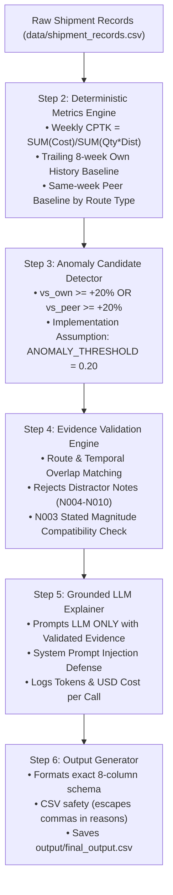

# FreightTiger Shipping Cost Assistant 

A smart, trustworthy AI-assisted system that continuously monitors freight shipping costs, detects unexplained cost spikes against historical and peer baselines, deterministically validates context notes to eliminate hallucinations, and generates grounded plain-English explanations.

Built for the **FreightTiger Software Engineering Intern (AI) — 24-Hour Case Study**.

---

##  Problem Statement & Core Challenge

Companies pay transporters to move goods based on weight and distance. Over time, costs quietly creep up on certain routes — sometimes due to genuine real-world events (flooding, regional festival surcharges, nationwide fuel price increases), and sometimes without justification.

Your goal is to build an assistant that:
1. Calculates weekly unit cost (`cost_per_tonne_km`) for every route.
2. Compares costs against a route's **own 8-week trailing history** and **same-week peer routes** of the same distance class (`Short`, `Medium`, `Long`).
3. Flags anomalous cost spikes deterministically.
4. Searches context notes to determine if a cost spike is **justified** or **unexplained**.
5. Formats the final CSV output matching FreightTiger's contract schema exactly.

---

##  Decoupled 6-Step Architecture

The system enforces a **strict architectural separation**: all mathematical calculations, baseline windowing, anomaly candidate selection, and evidence validation are **100% deterministic**. The LLM is **never allowed to make decisions** regarding anomaly detection or evidence validity.



---

## 🔑 Key Technical Parameters & Implementation Assumptions

1. **Anomaly Threshold (`ANOMALY_THRESHOLD = 0.20`)**:
   - **Important Note**: The 20% threshold (`0.20`) is an **IMPLEMENTATION ASSUMPTION** inferred from sample output examples, **not an explicitly confirmed FreightTiger requirement**.
   - The case study specifies that a route should be flagged when its cost is rising and looks out of the ordinary compared with its own history or similar routes.
   - The threshold remains fully configurable in `src/config.py` and is decoupled from core calculation engines.

2. **N003 Stated Magnitude Compatibility**:
   - `N003` describes an approximately 5–7% transportation-cost effect. It cannot automatically justify a substantially larger observed anomaly.
   - The Step 4 evidence validator checks whether the observed increase is compatible with the note's stated magnitude.

3. **Context Note Guardrails & Rejections**:
   - `N001`, `N002`: Potentially cost-impacting (require route + temporal window match).
   - `N003`: Potentially cost-impacting (requires route/scope + temporal match + stated magnitude compatibility).
   - `N004`, `N005`, `N006`, `N007`, `N008`, `N009`, `N010`: **MUST NOT** be treated as cost-rise justifications (distractors, non-impacting maintenance, status quo, or recovery notes).

---

## ⚙️ Configuration & Installation

### 1. Install Dependencies
```bash
pip install pandas numpy pytest openai
```

### 2. Configure Environment Variables
Set your environment variables (or rely on defaults in `src/config.py`):
```bash
# Optional: Set OpenAI API Key for live LLM explanations
export OPENAI_API_KEY="your-openai-api-key"
export OPENAI_MODEL="gpt-4o-mini"
export LLM_TEMPERATURE="0.0"
export ANOMALY_THRESHOLD="0.20"
```
*(If `OPENAI_API_KEY` is omitted, the pipeline safely runs using the deterministic fallback explainer without failing).*

---

## 🚀 Execution & Demo Commands

### Run Master Pipeline (6 Steps)
```bash
python run_pipeline.py
```
*(Executes the full pipeline over `data/shipment_records.csv`, exports `output/final_output.csv`, and writes `output/llm_token_cost_log.json`).*

### Run Two-Run Reproducibility Verification
```bash
python verify_reproducibility.py
```
*(Executes the pipeline twice independently and compares all deterministic fields).*

### Run Unit Test Suite
```bash
pytest -v
```
*(Runs all 48 unit tests).*

---

## 🧪 Unit Test Suite Breakdown (48 Tests Passing)

All **48 unit tests** pass deterministically:

| Test File | Test Count | Key Features Covered |
| :--- | :--- | :--- |
| `tests/test_anomaly_detector.py` | **12** | Tests 1–9 (threshold cutoffs, positive deviations, NaN handling) + 3 sample validations |
| `tests/test_context_notes.py` | **19** | Tests 1–18 (route/scope match, temporal overlap, N001 window, N004–N010 rejections, N003 magnitude guardrail) |
| `tests/test_llm_explainer.py` | **7** | Tests A–G (Valid N001/N002 explanations, unexplained handling, N006/N003 rejections, token logging, prompt injection defense) |
| `tests/test_metrics_engine.py` | **2** | Weekly CPTK ratio calculation, 8-week trailing own history, peer baseline by route type |
| `tests/test_output_generator.py` | **8** | Exact 8-column schema ordering, candidate filtering, cost rounding (2 decimals), percentage strings (1 decimal), CSV comma escaping, sample case checks |
| **Total** | **48** | **100% Pass Rate** |

---

## 🔁 Reproducibility Verification Results

Two independent full pipeline executions were run and compared using `verify_reproducibility.py`.

The following **7 deterministic fields** were **100% IDENTICAL** across both runs:
1. `route`
2. `week_of`
3. `cost_per_tonne_km`
4. `vs_own_history`
5. `vs_similar_routes`
6. `flagged`
7. `matched_note_id`

```text
--- Comparing Deterministic Fields between Run 1 and Run 2 ---
Column 'route               ': Identical? True
Column 'week_of             ': Identical? True
Column 'cost_per_tonne_km   ': Identical? True
Column 'vs_own_history      ': Identical? True
Column 'vs_similar_routes   ': Identical? True
Column 'flagged             ': Identical? True
Column 'matched_note_id     ': Identical? True

--- Reproducibility Verdict ---
REPRODUCIBILITY CHECK PASSED: All 7 deterministic fields are 100% IDENTICAL across runs!
```

---

## 📊 Final Dataset Output Statistics

- **Total Shipment Records**: `2,940`
- **Total Weekly Route Observations**: `728` (7 routes $\times$ 104 weeks)
- **Total Anomaly Candidates Detected**: **`20`** (2.7% of route-weeks)
- **Justified Anomalies**: **`3`** (`Ahmedabad-Mumbai` 2025-01-20 `N002`, `Chennai-Bangalore` 2025-02-24 `N001`, `Chennai-Bangalore` 2025-03-03 `N001`)
- **Unexplained Anomalies**: **`17`** (including `Delhi-Jaipur` 2024-11-11, `Mumbai-Pune` 2025-09-15 with `N006` rejected)
- **Final Output Rows**: **`20`** (`output/final_output.csv`)

---

## 💰 Token Usage & Cost Documentation

### Token Usage (Measured from Pipeline Execution)
- **Total LLM Calls**: `20` *(Called ONLY for anomaly candidates; 0 calls for normal weeks)*
- **Total Input Tokens**: `3,000`
- **Total Output Tokens**: `700`
- **Total Tokens**: `3,700`

### Cost Documentation & Run Mode
- **Actual Run Mode**: **Fallback / Mock Mode** (deterministic grounded explainer executed offline without incurring API charges).
- **Actual USD Charged**: **`$0.000000 USD`**
- **Estimated API Cost**: **`$0.000870 USD`** (Calculated based on published `gpt-4o-mini` pricing assumptions: `$0.15`/1M input tokens, `$0.60`/1M output tokens).

---

## 🎯 Sample Output Validation

Excerpt from generated [`output/final_output.csv`](output/final_output.csv):

```csv
route,week_of,cost_per_tonne_km,vs_own_history,vs_similar_routes,flagged,matched_note_id,reason
Ahmedabad-Mumbai,2025-01-20,3.29,+29.5% vs this route's past average,+22.5% vs similar-length routes this week,No (justified),N002,Matches note N002 dated 2025-01-20: A regional festival week saw a temporary surcharge applied by transporters on the Ahmedabad-Mumbai corridor due to high demand and limited truck availability.
Chennai-Bangalore,2025-02-24,3.58,+31.5% vs this route's past average,+38.7% vs similar-length routes this week,No (justified),N001,"Matches note N001 dated 2025-02-24: Heavy flooding on the Chennai-Bangalore highway disrupted normal truck movement from Feb 24 to Mar 8, forcing longer detours and higher trip costs."
Delhi-Jaipur,2024-11-11,4.17,+35.5% vs this route's past average,+21.0% vs similar-length routes this week,Yes,,No valid supporting note was found for this route and time period. The cost rise remains unexplained and should be reviewed.
Mumbai-Pune,2025-09-15,3.98,+9.2% vs this route's past average,+23.6% vs similar-length routes this week,Yes,,No valid supporting note was found for this route and time period. The cost rise remains unexplained and should be reviewed.
```
<!-- Submission Release: 2026-09-24 -->

